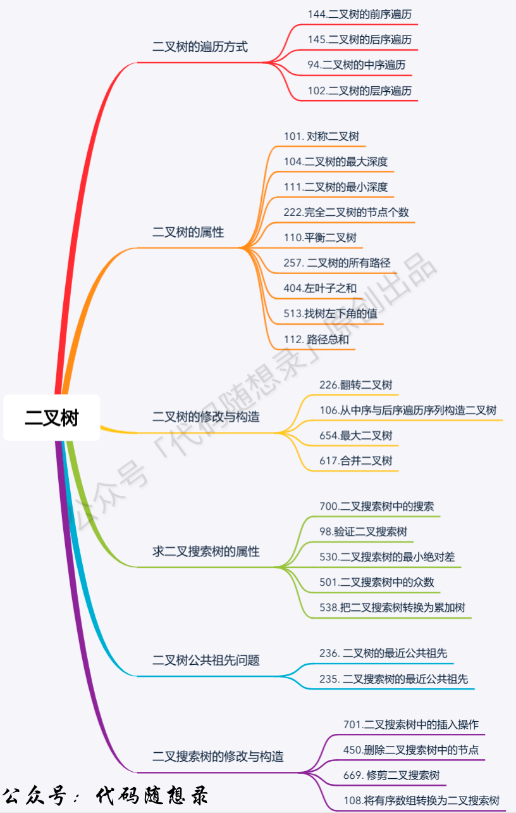
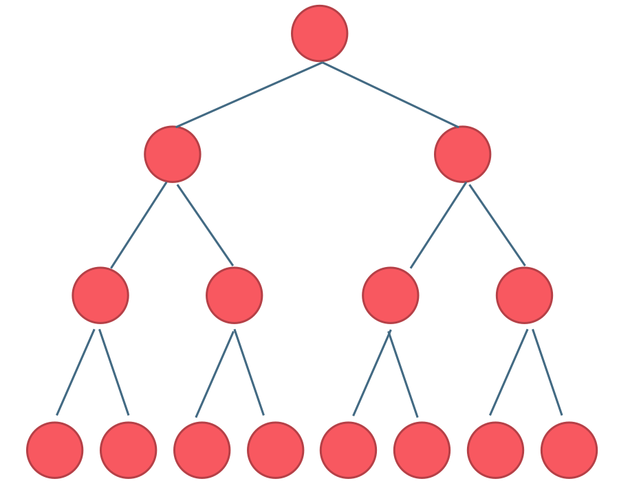
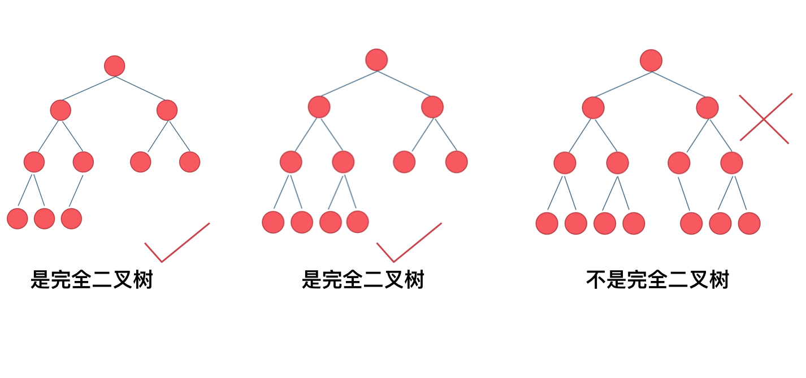
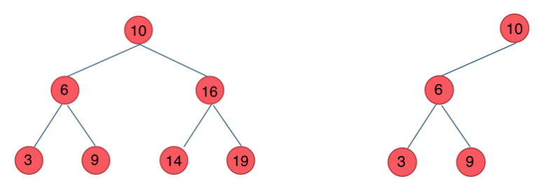
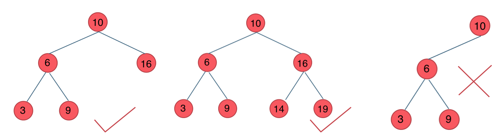

## 树
https://www.programmercarl.com/%E4%BA%8C%E5%8F%89%E6%A0%91%E7%90%86%E8%AE%BA%E5%9F%BA%E7%A1%80.html#%E4%BA%8C%E5%8F%89%E6%A0%91%E7%9A%84%E7%A7%8D%E7%B1%BB


* 根节点， 子节点， 叶子节点
* 树的高度：从下往上数，节点到叶子节点的最大值就是其高度。
* 树的深度：从上往下数，高度和深度是相反的，因此根节点的深度和叶子节点的高度是 0。
* 二叉树，三叉树，。。。 N 叉树，由其子节点最多可以有几个决定，最多有 N 个就是 N 叉树。

### 二叉树
```typescript
class Node {
    value: any;
    left: Node | null;
    right: Node | null;
    constructor(val?: number, left?: TreeNode, right?: TreeNode) {
        this.val = val === undefined ? 0 : val;
        this.left = left === undefined ? null : left;
        this.right = right === undefined ? null : right;
    }
}
```
### 二叉树的遍历

#### 深度优先遍历
 1. 前序
```
preorder(root) {
     if not root: return
     doSomething(root)
     preorder(root.left)
     preorder(root.right)
}
```
2. 中序
```
inorder(root) {
     if not root: return
     inorder(root.left)
     doSomething(root)
     inorder(root.right)
}   
```

3. 后序
```
inorder(root) {
     if not root: return
     doSomething(root)
     inorder(root.left)
     inorder(root.right)
}   
```

#### 广度优先遍历
1. 层序bfs
```
bfs(root) {
 queue = []
 queue.push(root)
 while queue.length {
  curLevel = queue
  queue = []
  for i = 0 to curLevel.length {
   doSomething(curLevel[i])
   if (curLevel[i].left) {
    queue.push(curLevel[i].left)
   }
   if (curLevel[i].right) {
    queue.push(curLevel[i].right)
   }
  }
 }
}

```

### 构造二叉树

 * 单前/中/后序遍历是无法确定一棵树

 * 但是中序序列和前、后，层次序列任意组合唯一确定一颗二叉树（前提是遍历是基于引用的或者二叉树的值都不相同）。
前、后，层次序列都是提供根结点的信息，中序序列用来区分左右子树。

### 满二叉树

* 深度为k，有2^k-1个节点的二叉树

### 完全二叉树

* 除了最底层节点可能没填满外，其余每层节点数都达到最大值，
* 并且最下面一层的节点都集中在该层最左边的若干位置。若最底层为第 h 层，则该层包含 1~ 2^(h-1)  个节点

### 二叉搜索树

* 左子树的所有节点值小于根的节点值
* 右子树的所有节点值大于根的节点值
* 二叉搜索树的中序遍历结果是一个有序列表

### 平衡二叉搜索树

* 它是一棵空树或它的左右两个子树的高度差的绝对值不超过1，并且左右两个子树都是一棵平衡二叉树。


